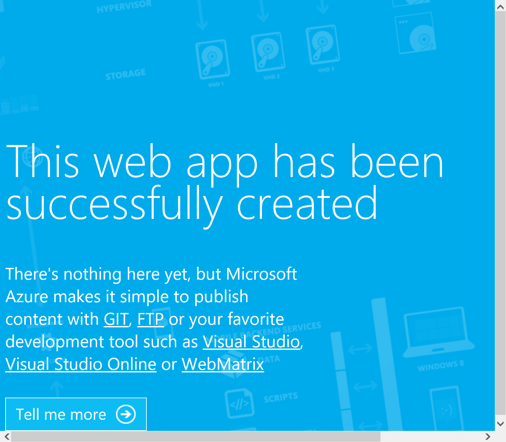

# DropWizard On Azure
This repository will describe the steps for getting started with DropWizard, as well as the steps for configuring and deploying a DropWizard application on Azure API Apps.

## Introduction
DropWizard is a popular platform for implementing REST web services in Java.  DropWizard contains the following components (amongst others):
        * Jetty for HTTP support
        * [Jersey](http://www.eclipse.org/jetty/) for Java Rest support 
        * Jackson for Java to JSON conversion
        * [Metrics](http://metrics.codahale.com/) library for production monitoring

## Initial setup
1. DropWizard leverages the Maven build tool - if you like another one (for example, Gradle) you can use that, but you'll have to figure that out yourself.  To get started, you'll have to install Maven on your development machine. Reference the [Maven home page](http://maven.apache.org) for instructions.

1. We need to create a development directory.  In this guide, I'll be using `c:\dw` as my development directory, but you can use whatever you'd like.  Go to this directory.  
1. We are going to generate an initial DropWizard application using maven with this command:
    ```CMD
    mvn archetype:generate  -DgroupId=com.dwonazure  -DartifactId=DWOnAzure  -Dname=DWOnAzure  -Dpackage=com.dwonazure  -DarchetypeGroupId=io.dropwizard.archetypes  -DarchetypeArtifactId=java-simple  -DinteractiveMode=false
    ```
1. We will need to write a class that provides the web service.  Create a new file `DwOnAzure\src\main\java\com\dwonazure\resources\HelloResource.java with this code:
    ```Java
    package com.dwonazure.resources;

    import javax.ws.rs.GET;
    import javax.ws.rs.Path;
    import javax.ws.rs.Produces;
    import javax.ws.rs.core.MediaType;
    import com.dwonazure.core.Greeting;

    @Path("/hello")
    public class HelloResource {

        @GET
        @Produces(MediaType.TEXT_PLAIN)
        public String getGreeting() {
            return "Hello world!";
        }

        /**
        * Resource method producing greeting in JSON format.
        *
        * @return a Greeting object
        */
        @Path("/hello_json")
        @GET
        @Produces(MediaType.APPLICATION_JSON)
        public Greeting getJSONGreeting() {
            return new Greeting("Hello world!");
        }
    }
    
    ```

1. Create the greeting object that the service will return.  Create `DwOnAzure\src\main\java\com\dwonazure\core\Greeting.java` with this code:
    ```Java
    package com.dwonazure.core;

    import com.fasterxml.jackson.annotation.JsonProperty;

    public class Greeting {

        @JsonProperty
        private String greeting;

        public Greeting() {
        }

        public Greeting(String greeting) {
            this.greeting = greeting;
        }

        public String getGreeting() {
            return greeting;
        }

        @Override
        public String toString() {
            return "Greeting{" + "greeting=" + greeting + '}';
        }

    }
    
    ```

1. Finally, we need to register the `HelloResource` in the application. Open `DWOnAzure\src\main\java\com]dwonazure\DwOnAzureAppliation.java` and add this line to the `run` method:
    ```Java
    // TODO: implement application
	environment.jersey().register(new HelloResource());
    ```
    also, add the import for `com.dwonazure.resources.HelloResource` at the top;


1. You can build the application by going to the `DwOnAzure` directory and running maven:
    ```CMD
    mvn package
    ```
1. run the application with this command:
    ```CMD
    java -jar target/DWOnAzure-1.0-SNAPSHOT.jar server 
    ```

1. You can test the application using any HTTP client, but [curl](http://curl.haxx.se) is quite convenient.  To use curl after installing, open a comman window and type `curl http://localhost:8080/hello`.  You should get a response of `Hello world!`.  If you use `curl http://localhost:8080/hello/hello_json`, you should see a JSON response like this:  `{"greeting":"Hello world!"}`

1. For deployment in an Azure API App Service, we need to get the HTTP port number from the `HTTP_PLATFORM_PORT` environment variable.  To do this, we need to make minor changes to the application.  first, open up `DWOnAzureApplication.java`, and add this code to the `initialize` method:
    ```Java
	bootstrap.setConfigurationSourceProvider(
                new SubstitutingSourceProvider(bootstrap.getConfigurationSourceProvider(),
                                                   new EnvironmentVariableSubstitutor(false)
                )
			);
    ```
    Also add imports for the two classes:
    ```Java
    import io.dropwizard.configuration.EnvironmentVariableSubstitutor;
    import io.dropwizard.configuration.SubstitutingSourceProvider;

    ```

    This ensures that the application will apply environment variables to the application configuration.

1. Next, let's open the`config.yml` file in the main `DWOnAzure` directory, and add this content:
    ```
    server:
        applicationConnectors:
        - type: http
          port: !!int ${HTTP_PLATFORM_PORT}
    ```
        >this file is very sensitive to the indentation - make sure it's two spaces for each level.

    This will tell DropWizard to get configure the http server to use the port specified by HTTP_PLATFORM_PORT.

1. rebuild the application using `mvn package`.  To test our configurations, run the application with these commands:
    ```CMD
    set HTTP_PLATFORM_PORT=8083
    java -jar target/DWOnAzure-1.0-SNAPSHOT.jar server ./config.yml 
    ```
    You should get several lines of output, with one that looks like this:
    ```
    INFO  [2016-11-15 18:24:00,533] org.eclipse.jetty.server.AbstractConnector: Started application@4c168660{HTTP/1.1,[http/1.1]}{0.0.0.0:8083}
    ```
1. To test the application, use this curl command: `curl http://localhost:8083/hello`.  THis will show that our configuration is working properly.

1. Lets deploy this application to an Azure API app.  We will be using the kudu interface, but you can upload your application using FTP or webdeploy as well. To configure the Azure API app, we will first need a web.config file.  Create that file in our `DWOnAzure` directory, and add this content:
    ```XML
    <?xml version="1.0" encoding="UTF-8"?>
    <configuration>
    <system.webServer>
        <handlers>
        <add name="httpPlatformHandler" path="*" verb="*" modules="httpPlatformHandler" resourceType="Unspecified" />
        </handlers>
        <httpPlatform processPath="%JAVA_HOME%\bin\java.exe"
            arguments="-Djava.net.preferIPv4Stack=true -jar &quot;%HOME%\site\wwwroot\DWOnAzure-1.0-SNAPSHOT.jar&quot;  &quot;%HOME%\site\wwwroot\config.yml&quot;">
        </httpPlatform>
    </system.webServer>
    </configuration>    
    ```
    This will tell the Azure API App service environment to run our jar application rather than Tomcat or another servlet engine.  This is because DropWizard packages Jetty and all other necessary components in the application jar file.
1. In the Azure portal, create a resource group to contain your API app. Open the Resource group blade by clicking `Resource groups`:
    

    Then click the `+ Add` button:

    

    Give the Resource Group a name, choose your subscription, and choose the default location, and click `Create`:

    

    Click `refresh` in the resource group list blade, and then click the resource group that you just created.  In the resource group detail blade, click `+add`:
    
    

    In the blade that comes up, type `API App` in the search box, and choose `API App`:
    
    

    Click `Create` in the API App blade.  Give the app a name, and choose the subscription, resource group and app service plan to use for the API app.  We will configure Application Insights later, so leave it off for now:
    
    

1. Back in the resource group blade, click `refresh` and we should see our new API app:
    
    

    Click on the app, and in the App Service blade that comes up, click on `Application settings`:
    
    

    Set the Java version to `Java 8`, the Java Minor Version to `Newest`, and the Web Container to `Newest Tomcat 8.5` (although we will not be using Tomcat here).  Click Save.
    
    

    Click `Overview` in the app service blade, and click `browse`:

    

    This should bring up the default page:

    

    In the browser url, add `.scm` before `.azurewebsites.net`, and hit enter.  You should now see the `Kudu` console:

    

    Click `Debug console` and choose `CMD`:

    

    In the page that comes up, click on `site`

    

    And then click on `wwwroot`.  Next, open up your development directory in a file explorer, and drag the `config.yml`, DWOnAzure-1.0-SNAPSHOT.jar, and web.config` onto the webapps directory in the browser.

    Go back to the API App blade in the Azure portal and click restart.  Wait 3-5 minutes for the restart, then test the application using (eg.) curl:

    

    Our API is now running in an Azure API app.


